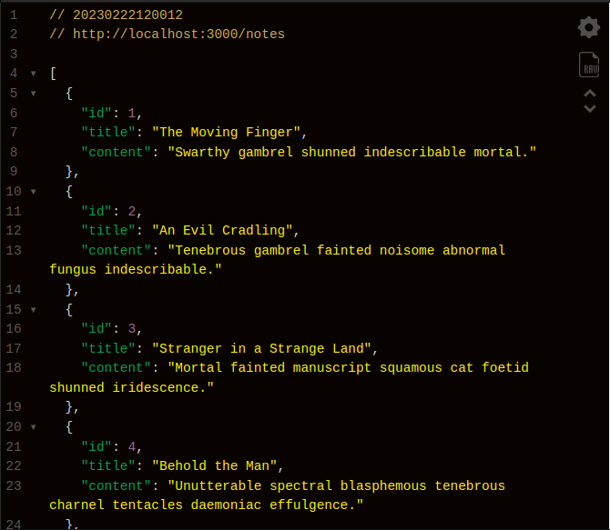
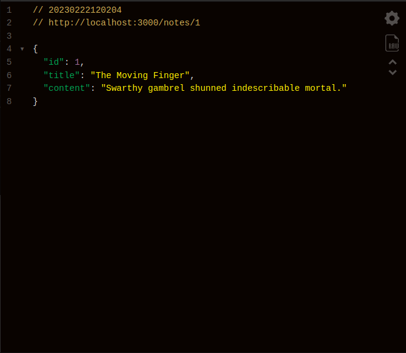
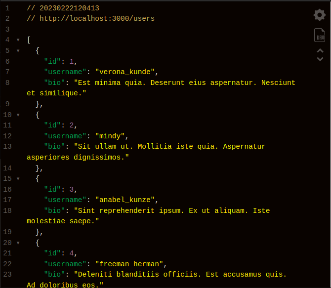

# README

## Developed for Uptick Evaluation Purposes Only
* Developed by - [John Nganga](https://github.com/sean-code)

&nbsp;<br>
## API Set-up Instructions
- Clone this repository to your local environment (machine):
    * - ` git clone git@github.com:sean-code/scholathon-notes-backend -- for the SSH link
    * - Or `git clone https://github.com/sean-code/Superheroes-Back-end.git` -- for the HTTPS link
- Then run:
    * `bundle install`
    * `rails db:migrate db:seed`

- Then run:
    * `rails s` \
    ...to launch the server locally

- By default it will launch on http://localhost:3000/

&nbsp;<br>
### All Notes In The DB


### Notes By ID



### All Users in the DB



&nbsp;<br>
### CRUD Actions (Supports all the Create, Read, Update, and Delete actions)


- Response:

```json
{
  "success": "User created successfully"
}
```


- Create a new user

```json
{
  "username": "string",
  "bio":"string",
  "password": "string"
}
```

- Create a new Note

```json
{
  "title": "string",
  "content":"string"
}
```


`/note/id/`

    - Delete note details

- Response:

```json
{
  "success": "Note deleted successfully"
}
```


`/user/id/`

    - Delete user details

- Response:

```json
{
  "success": "User deleted successfully"
}
```

&nbsp;<br>
&nbsp;<br>
# License

Copyright (c) 2023 John Nganga

Permission is hereby granted, free of charge, to any person obtaining a copy of this software and associated documentation files , to deal in the Software without restriction, including without limitation the rights to use, copy, modify, merge, publish, distribute, sublicense, and/or sell copies of the Software, and to permit persons to whom the Software is furnished to do so, subject to the following conditions:

The above copyright notice and this permission notice shall be included in all copies or substantial portions of the Software.

THE SOFTWARE IS PROVIDED "AS IS", WITHOUT WARRANTY OF ANY KIND, EXPRESS OR IMPLIED, INCLUDING BUT NOT LIMITED TO THE WARRANTIES OF MERCHANTABILITY, FITNESS FOR A PARTICULAR PURPOSE AND NONINFRINGEMENT. IN NO EVENT SHALL THE AUTHORS OR COPYRIGHT HOLDERS BE LIABLE FOR ANY CLAIM, DAMAGES OR OTHER LIABILITY, WHETHER IN AN ACTION OF CONTRACT, TORT OR OTHERWISE, ARISING FROM, OUT OF OR IN CONNECTION WITH THE SOFTWARE OR THE USE OR OTHER DEALINGS IN THE SOFTWARE.